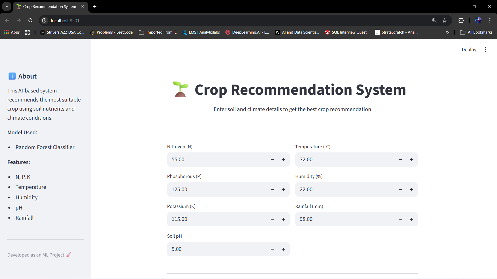
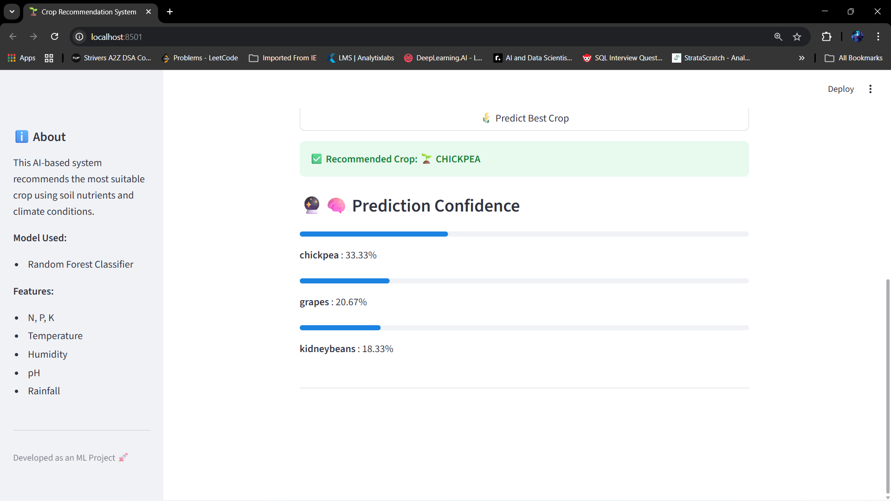

# 🌱 Crop Recommendation System

An AI-powered Crop Recommendation System that predicts the most suitable crop based on soil nutrients and climate conditions using Machine Learning.

This project demonstrates an end-to-end ML workflow including data preprocessing, model training, evaluation, and provides a user-friendly interface using Streamlit.

---

## 🔍 Problem Statement

Farmers often struggle to choose the right crop due to varying soil properties and climate conditions. Incorrect crop selection can lead to low yield and financial loss.

This system helps farmers and agricultural planners by recommending the best crop based on scientific data.

---

## 🚀 Features

- Predicts the **best crop** based on:
  - Nitrogen (N)
  - Phosphorus (P)
  - Potassium (K)
  - Temperature (°C)
  - Humidity (%)
  - Soil pH
  - Rainfall (mm)
- Displays **prediction confidence (%)**
- Interactive & user-friendly **Streamlit web interface**
- Uses **Random Forest Classifier**
- Model and scaler saved using `joblib`
- **Try the live app here:** [Know Your Crop](https://know-your-crop.streamlit.app/)

---

## 🧠 Machine Learning Model

- **Algorithm:** Random Forest Classifier
- **Why Random Forest?**
  - Handles non-linear data well
  - Robust to noise
  - Works well with tabular agricultural data
- **Evaluation Metric:** Accuracy
- **Prediction Confidence:** Calculated using `predict_proba()`

---

## 🖥️ Web Application Screenshots

### 🏠 Home Page

### 📊 Prediction Result & Confidence

